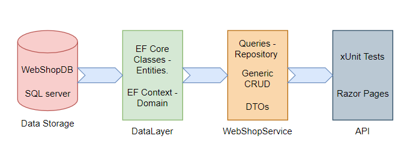

# EF Core Webshop

## About The Project
The project and its specifications are defined by the assignment in relation to our lectures on `EF Core` and `Linq`, for which the project is to be handed in as a group project. Our group is formed by **Jasmin 'Jeongoks' Nielsen** and **Mike '_Oiski_' Mortensen**

### DB Drawing of the Project Build
The structure approach is _Folder-By-Type_.

We are using an SQL server as our Data Storage, which we can access from our `DataLayer` inside of our project. The `DataLayer` contains our EF Core Classes in a folder called _Entities_ and our `DBContext` is in the folder called _Domain_. 

Then we have our Webshop `ServiceLayer` where we store all of our services as well as our Generic CRUD and Data Transfer Objects, as well as a folder for _Extensions_ To have our Extension methods in one place.

Our API will use xUnit testing to begin with, to check if our `Data Layer` and `ServiceLayer` works with the Queries that we've created in the `ServiceLayer`. In the future we will be hooking this project up to a Web API, using Razor Pages.


## Dependencies
- [Microsoft.EntityFramworkCore.SqlServer](https://www.nuget.org/packages/Microsoft.EntityFrameworkCore.SqlServer/)
- [Microsoft.EntityFrameworkCore.Design](https://www.nuget.org/packages/Microsoft.EntityFrameworkCore.Design/5.0.10)
- [Microsoft.EntityFrameworkCore.Tools](https://www.nuget.org/packages/Microsoft.EntityFrameworkCore.Tools/5.0.10)
- [Blazored.LocalStorage](https://www.nuget.org/packages/Blazored.LocalStorage/)

### Terms of Development

- **Specifications**
  - **Frontpage**
    - [ ] Front page shows an amount of product with a picture, the price, the name and a button to place the product in the cart.
    - [ ] Paging is used, so that the front page only shows a certain amount of products on each page. Showcase there's more than one product.
    - [ ] Search feature where the user has the option to search on "Brand" or "Type" of the product.
    - [ ] Search feature with free-text searching.
    - [ ] Option to make the filtering of the products shown ASC or DESC.
    - [ ] An icon of a cart is shown, as well of the quantity of the products laying in it. If the icon is clicked, it will show the shop cart.
    - [ ] If a product is added to the cart, it will be shown on the icon, as well as the updated shop cart.
  - **Shop Cart**
    - [ ] The shop cart shows an updated list of chosen products, with picture, name, price per product, quantity (can changes).
    - [ ] There needs to be an Update button, which will update the prices if the user changes the quantity already in the cart.
    - [ ] It needs to be possible to remove a product from the cart, if the user regrets that choice.
    - [ ] There needs to be a Checkout button, which leads to the Checkout-page.
    - [ ] There needs to be a button, which gives the user the opportunity to continue shopping, before going to the checkout.
  - **Checkout**
    - [ ] The user has to give information about their Email, Name, Address, choice of Payment Method and Delivery type.
    - [ ] When the user clicks on the 'Buy' button, they have to receive a mail as a confirmation on their order.
  - **Administrator**
    - [ ] An Admin page, giving the adminstrator a list of all the `Products`.
    - [ ] The Admin page will need the ability to Edit and Delete the `Products`.
    - [ ] There will be docus on demonstrating Update and Delete in a graph of data.
  - **Additional Optional Specifications**
    - [ ] When the mouse hovers over a picture of a product, add some shadow behind it, to highlight it.
    - [ ] Opportunity to log in, perhaps when the user is on the Checkout page.
    - [ ] If the user is already logged in, then they won't have to write their information again.
    - [ ] Make an admin page, giving an administrator a list of all products and the opportunity to update and modify them.

## The program
The assignments states that the following criteria:

**Goal**
> Demonstrate that one can design, program and test a database model that meets the specifications written under _Terms of Development_. The core is to be able to browse through > a collection of shop items, add shop items to a cart, sign up and simulate a purchase.

**Input**
> Input will be provided through a web interface, which is implemented in the second part of the assignment.

**Output**
> Data will be stored in a local SQL Database, which will be controlled and accessed through an EF Core datalayer project.

See the [Wiki](https://github.com/ZhakalenDk/Oiski.School.Wepshop_H3_2021/wiki) for more in depth information about the project.

## Scripts

<details>
  <summary>SQL Installationsscript.</summary>
  
  ```SQL
  CREATE DATABASE WebShopDB
GO
USE WebShopDB
GO
BEGIN TRANSACTION;
GO

CREATE TABLE [CustomerLogins] (
    [CustomerLoginID] int NOT NULL IDENTITY,
    [CustomerID] int NOT NULL,
    [Password] nvarchar(max) NULL,
    CONSTRAINT [PK_CustomerLogins] PRIMARY KEY ([CustomerLoginID])
);
GO

CREATE TABLE [Products] (
    [ProductID] int NOT NULL IDENTITY,
    [Title] nvarchar(max) NULL,
    [Description] nvarchar(max) NULL,
    [BrandName] nvarchar(max) NULL,
    [Price] decimal(18,2) NOT NULL,
    [InStock] int NOT NULL,
    CONSTRAINT [PK_Products] PRIMARY KEY ([ProductID])
);
GO

CREATE TABLE [Types] (
    [TypeID] int NOT NULL IDENTITY,
    [Name] nvarchar(max) NULL,
    CONSTRAINT [PK_Types] PRIMARY KEY ([TypeID])
);
GO

CREATE TABLE [Customers] (
    [CustomerID] int NOT NULL IDENTITY,
    [CustomerLoginID] int NULL,
    [FirstName] nvarchar(max) NULL,
    [LastName] nvarchar(max) NULL,
    [Email] nvarchar(max) NULL,
    [Country] nvarchar(max) NULL,
    [City] nvarchar(max) NULL,
    [ZipCode] int NOT NULL,
    [Address] nvarchar(max) NULL,
    [PhoneNumber] nvarchar(max) NULL,
    [PaymentMethod] int NOT NULL,
    [DeliveryType] int NOT NULL,
    CONSTRAINT [PK_Customers] PRIMARY KEY ([CustomerID]),
    CONSTRAINT [FK_Customers_CustomerLogins_CustomerLoginID] FOREIGN KEY ([CustomerLoginID]) REFERENCES [CustomerLogins] ([CustomerLoginID]) ON DELETE NO ACTION
);
GO

CREATE TABLE [ProductImages] (
    [ProductImageID] int NOT NULL IDENTITY,
    [ProductID] int NOT NULL,
    [ImageStream] varbinary(max) NULL,
    [Title] nvarchar(max) NULL,
    CONSTRAINT [PK_ProductImages] PRIMARY KEY ([ProductImageID]),
    CONSTRAINT [FK_ProductImages_Products_ProductID] FOREIGN KEY ([ProductID]) REFERENCES [Products] ([ProductID]) ON DELETE CASCADE
);
GO

CREATE TABLE [ProductTypes] (
    [ProductID] int NOT NULL,
    [TypeID] int NOT NULL,
    CONSTRAINT [PK_ProductTypes] PRIMARY KEY ([ProductID], [TypeID]),
    CONSTRAINT [FK_ProductTypes_Products_ProductID] FOREIGN KEY ([ProductID]) REFERENCES [Products] ([ProductID]) ON DELETE CASCADE,
    CONSTRAINT [FK_ProductTypes_Types_TypeID] FOREIGN KEY ([TypeID]) REFERENCES [Types] ([TypeID]) ON DELETE CASCADE
);
GO

CREATE TABLE [Orders] (
    [OrderID] int NOT NULL IDENTITY,
    [CustomerID] int NOT NULL,
    [OrderDate] datetime2 NOT NULL,
    CONSTRAINT [PK_Orders] PRIMARY KEY ([OrderID]),
    CONSTRAINT [FK_Orders_Customers_CustomerID] FOREIGN KEY ([CustomerID]) REFERENCES [Customers] ([CustomerID]) ON DELETE CASCADE
);
GO

CREATE TABLE [OrderProducts] (
    [ProductID] int NOT NULL,
    [OrderID] int NOT NULL,
    CONSTRAINT [PK_OrderProducts] PRIMARY KEY ([ProductID], [OrderID]),
    CONSTRAINT [FK_OrderProducts_Orders_OrderID] FOREIGN KEY ([OrderID]) REFERENCES [Orders] ([OrderID]) ON DELETE CASCADE,
    CONSTRAINT [FK_OrderProducts_Products_ProductID] FOREIGN KEY ([ProductID]) REFERENCES [Products] ([ProductID]) ON DELETE CASCADE
);
GO

CREATE UNIQUE INDEX [IX_Customers_CustomerLoginID] ON [Customers] ([CustomerLoginID]) WHERE [CustomerLoginID] IS NOT NULL;
GO

CREATE INDEX [IX_OrderProducts_OrderID] ON [OrderProducts] ([OrderID]);
GO

CREATE INDEX [IX_Orders_CustomerID] ON [Orders] ([CustomerID]);
GO

CREATE INDEX [IX_ProductImages_ProductID] ON [ProductImages] ([ProductID]);
GO

CREATE INDEX [IX_ProductTypes_TypeID] ON [ProductTypes] ([TypeID]);
GO

COMMIT;
GO

  ```
  
 </details>

## Diagrams

### Class Diagram over Entities


### Entity Relation Diagram over DB


## Versioning
Versioning is coordinated according to the following template: [_Major_].[_Minor_].[Patch].\
Each `Feature` must be branched out and developed on an isolated branch and merged back into the `Developer` branch when done.

The syntax for the structure of branch folders must be presented as: [MajorVersion]/[DeveloperName]/[BranchName], where as [BranchName] should be formatted as follows: [Feature]_[SubFeature].\
**Example:**
>**Folder Structure:** _v1/Oiski_ \
>**Branch Name:** _Interface_MainMenu_ \
>**Full Path:** _v1/Oiski/MainMenu_UIOverhaul_

### Change Log
- **[v0.0.0](https://github.com/Mike-Mortensen-Portfolio/Oiski.School.Webshop_H3_2021/releases/tag/v0.0.0)**
    - Added
        - Project Solution
        - Console Application Project - _For testing features_
        - Datalayer Class Library project - _The backend stuff (EF Core)_
- **[v0.1.0](https://github.com/Mike-Mortensen-Portfolio/Oiski.School.Webshop_H3_2021/releases/tag/v0.1.0)**
    - **Added**
        - `WebShopContext` with ConnectionString.
    - **Prepared**
        - Properties of `DbSet<>` of Entities.
        - DataSeeding for Initialize of Database.
- **[v0.2.0](https://github.com/Mike-Mortensen-Portfolio/Oiski.School.Webshop_H3_2021/releases/tag/v0.2.0)**
    - **Added**
        - `Customer` class
        - `CustomerLogin` class - _The login Info for a customer_
        - `Order` class
        - `Product` class
        - `ProductImage` class
        - `Type` class - _A product type container (Many to Many)_
    - Modified
        - README file to include a section for diagrams and added class diagram over entities
- **[v0.2.1](https://github.com/Mike-Mortensen-Portfolio/Oiski.School.Webshop_H3_2021/releases/tag/v0.2.1)**
    - **Fixed**
        - Password is now a string as intended
- **[v0.3.0](https://github.com/Mike-Mortensen-Portfolio/Oiski.School.Webshop_H3_2021/releases/tag/v0.3.0)**
    - **Fixed**
        - `ImageID` changed to `ProductImageID`, to create Primary Key.
        - Added a Reference Navigational Property to `Customer` inside of `Order`. 
- **[v0.3.1](https://github.com/Mike-Mortensen-Portfolio/Oiski.School.Webshop_H3_2021/releases/tag/v0.3.1)**
    - **Added**
        - Inside of `WebShopContext` and in the `OnModelCreating()` there's added a `region` called DATA SEEDING, all of the data is in a comment, due to some `Entities` missing.
- **[v0.4.0](https://github.com/Mike-Mortensen-Portfolio/Oiski.School.Webshop_H3_2021/releases/tag/v0.4.0)**
    - **Added**
        - `ProductType` class
        - `OrderProduct` class
        - Combined key for `OrderProduct` and `ProductType` in `WebshopContext`
        - Defined `CustomerLogin` property as Foreign Key in `Customer`
        - Added an Orders Collection Navigational Property in `Customer`
        - Specified custom table names for all classes
    - **Removed**
        - Orders Navigational Property in `CustomerLogin`
        - Added `OrderProduct` Navigational Property in `Order`
        - Added `OrderProduct` Navigational Property in `Product`
        - Added Navigational Property for `ProductType` in `Product`
        - Added `ProductID` Property in `ProductImage`
        - Added `ProductType` Navigational Property in `Type`
        - Added DB ER-Diagram
    - **Changed**
        - Rearranged Class Diagram
        - Added DB ER-Diagram to README
        - Rebuilded Initial Migration configuration
- **[v0.4.1](https://github.com/Mike-Mortensen-Portfolio/Oiski.School.Webshop_H3_2021/releases/tag/v0.4.1)**
    - **Added**
        - Added an extension to `IQueryable<Product>` to sum up a total of all prices in a sequence.
- **[v0.5.0](https://github.com/Mike-Mortensen-Portfolio/Oiski.School.Webshop_H3_2021/releases/tag/v0.5.0)**
    - **Added**
        -  Save Changes to `Add<T>(T)` in `WebshopContext`: _Pushes a new entity to DB_
        - `Update<T>(T)` to `WebshopContext`: _Updates an existing entity in DB_
        - `Delete<T>(T)` to `WebshopContext`: _Deletes an entity from DB_
        - `Find<T>(Func<T, bool>)` to `WebshopContext`: _Builds an extenable query that targets a specific sequence of type T_
- **[v0.5.1](https://github.com/Mike-Mortensen-Portfolio/Oiski.School.Webshop_H3_2021/releases/tag/v0.5.1)**
    - **Modified**
        - Removed Singleton pattern and implemented a public construcor in its place.
        - Renamed (__and fixed__) `Find<T>(Fact<T, bool>)` to `GetQueryable<T>()` and changed its behavior to return a `DBSet<T> `IQueryable` object instead of a conditional `Where{T}` object.
        - Rearranged **InMemory** and **SQL** XUnit Tests to make use of the new structure.
- **[v0.6.0](https://github.com/Mike-Mortensen-Portfolio/Oiski.School.Webshop_H3_2021/releases/tag/v0.6.0)**
    - **Added**
        - Razor Pages project
    - **Removed**
        - Console Application Project
- **[v0.6.1](https://github.com/Mike-Mortensen-Portfolio/Oiski.School.Webshop_H3_2021/releases/tag/v0.6.1)**
    - **Modified**
        - Changed `CustomerLogin` to `User`
        - Added `IsAdmin` property to `User` class
- **[v0.6.2](https://github.com/Mike-Mortensen-Portfolio/Oiski.School.Webshop_H3_2021/releases/tag/v0.6.2)**
    - **Modified**
        - `CustomerLoginID` is now `UserID` in `Customer`
        - `CustomerLogin` is now `User` in `Customer`
- **[v0.7.0](https://github.com/Mike-Mortensen-Portfolio/Oiski.School.Webshop_H3_2021/releases/tag/v0.7.0)**
    - **Added**
        - Front page added as a template, awaiting for backend coding.
        - Shopping cart page added as a template, awaiting for backend coding.
        - Data seeding updated with more `Products` as well as `Types`.
- **[v0.7.1](https://github.com/Mike-Mortensen-Portfolio/Oiski.School.Webshop_H3_2021/releases/tag/v0.7.1)**
    - **Added**
        - `SearchOptions` to handle specification applied to searching
        - Added `Order` Extension for  `IQueryable<ProductDisplayDTO>` 
        - Context field to be readonly in `WebshopService`
        - `ProductDisplayDTO` to map `Product` in UI
        - `DTO` mapper for `Products`
        - `FilterPagingOptions` to hande specific conditions for searchin/filtering and paging
         - `FilterPaging` method to `WebshopService`
        - `FreeSearchTitle` method in `ProductDisplayDTOExtensions`
    - Modified
        - Corrected spelling mistake in `ProductImage`
- **[v0.7.2](https://github.com/Mike-Mortensen-Portfolio/Oiski.School.Webshop_H3_2021/releases/tag/v0.7.2)**
    - **Added**
        - Login page has been added with HTML template, awaiting for backend coding.
- **[v0.7.3](https://github.com/Mike-Mortensen-Portfolio/Oiski.School.Webshop_H3_2021/releases/tag/v0.7.3)**
    - **Added**
        - `CustomerDTO`
        - `OrderProductDTO`
        - `UserDTO`: A fusion between `User` and `Customer` from DB
        - `OrderExtensions`: Includes mapping functionality and collection conversion
        - `OrderProductExtensions`: Includes mapping funcitonality
        - `UserExtensions`
    - **Modified**
        - `ProductExtensions`
        - `WebshopService`
            - **Fecth all `Products`:** _With all subtables included. Use to collect a list of all `Products` in DB._
            - **Fecth `Product` by ID**:  _With all subtables included. Use to get a specific `Product`._
            - **Fetch `Order` by ID:** _With all subtables inluded. Use to get a specific `Order`._
            - **Fetch `OrderProducts` by `Order`.ID**: _With all subtables includes. Use to get `OrderProducts` related to a specific `Order`._
            - **Fetch `OrderProducts` by `Customer`.ID**: _With all subtables included.  Use to get `OrderProducts` related to a specific `Customer`._

        - `ProductImage` property is now called `DisplayImage`
- **[v0.7.4](https://github.com/Mike-Mortensen-Portfolio/Oiski.School.Webshop_H3_2021/releases/tag/v0.7.4)**
     - **Added**:
   - User creation page;
     - HTML template where a user can create themselves as a `Customer` with a Login.
   - AdminIndex page;
     - HTML template where a user who `IsAdmin` can manage all `Products` in a CRUD structure.
   - ProductCRUD folder;
     - Edit 
       - When clicking the edit button, you will route to an Edit page with the `ProductID` which are attached to that `Product`.
     - Details
       - Here you can view a `Product` with all of the information given in the database.
       - This is shown through a Partial page, described below.
     - Delete
       - When clicking the delete button, you will be routed to a Delete page with the `ProductID` which are attached to that `Product`. 
       - This page is to make the Admin make sure they really want to delete the `Product`, a sort of validation page.
       - The `Product` details are shown through a partial page, so that the Admin can double check if it's the right `Product` they wanna remove.
   - Partials folders;
     - _ProductDetailsPartial
       - Added a view of all the information given to a `Product`.
       - This is to reuse it on other pages. 
 - **Modified**:
   - Folder structure;
     - LoginIndex and AdminIndex has been moved to the User folder, as these make sense to have in the same folder, instead of each their own.
- **[v0.7.5](https://github.com/Mike-Mortensen-Portfolio/Oiski.School.Webshop_H3_2021/releases/tag/v0.7.5)**
    - **Modified**
        - `ProductImage`Table has now a `string` `ImageURL` instead of `byte[]` `ImageStream`.
        - Added Data seeding with the path to the Images.
- **[v0.7.6](https://github.com/Mike-Mortensen-Portfolio/Oiski.School.Webshop_H3_2021/releases/tag/v0.7.6)**
    - **Added**
        - `WebshopLoginService`: Can validate a user against DB
    - **Modified**
        - `UserExtensions`: Fixed an issue where `UserDTO` wasn't created correctly. Issue should be resolved but it now collects `Customer` objects and bases the DTO off of that instead of `User`.
        - `WebshopService` should be fixed now
            - `GetOrderProductsByOrder` to now probably get the objects `AsNoTracking()`
            - `GetOrderProductsByCustomer` to now also build the proper `OrderProduct` objects `AsNoTracking()`
            - `GetUserByID` should now build a proper `UserDTO` (_Implements the new Mappers described above_)
            - `GetUserByEmail` should now also build proper DTO's `AsNoTracking()`
- **[v0.7.7](https://github.com/Mike-Mortensen-Portfolio/Oiski.School.Webshop_H3_2021/releases/tag/v0.7.7)**
    - **Added**
      - `TypeDTO` to map DB `Type` to
    - **Modified**
      - `WebshopService`, which nows includes
        - `GetAllTypes()`, which will fetch all types in DB and map them to `TypeDTO`
        - `GetTypeByID(int)`, which fetch the `Type` that matches the provided ID and map it to a `TypeDTO`
- **[v0.7.8](https://github.com/Mike-Mortensen-Portfolio/Oiski.School.Webshop_H3_2021/releases/tag/v0.7.8)**
    - **Modified**
        - Below Classes in ServiceLayer have been modified:
          - ProductDisplayDTOExtensions:
            - Modified Paging(), to now skip the pages in the right way.
          - ProductExtensions:
        - Modified MapToDisplayDTO(), to not have it include(p => p.types)
          - Modified MapToDisplayDTO(), to also return a `ProductImages`.
        - ProductsCRUD.Delete:
          - Removed old OnGet data.
        - ProductsCRUD.Edit:
          - Removed old OnGet data.
        - ProductsCRUD.Details:
          - Removed old OnGet data.
       -  Below Pages in WebApp have been modified:
        - AdminIndex:
          - Removed old OnGet data.
        - Index.cshtml.cs:
          - Able to get FilterPagingOptions and attaching them to the Bindproperties used in Index.cshtml.
          - OnPostAddToCart() can now add a product by its ID to a new Order.
        - Index.cshtml:
          - Pagination added.
   -  Below Classes in DataLayer have been modified:
      - WebShopContext
          - Data seeding for the ProductImages have been modified to display them properly up in the WebApp.
- **[v0.7.9](https://github.com/Mike-Mortensen-Portfolio/Oiski.School.Webshop_H3_2021/releases/tag/v0.7.9)**
   - **Fixed**
     - An issue where `Customers` didn't have their `UserID` if a login existed
     - An issue that prevented our tests from running because `GetQueryable<T>()` is internal and they depended on the method. The issue was resolved by extending the `WebshopService.GetAllProducts()` to return an `IQueryable<ProductDTO>()` instead of an `IList<ProductDTO>`. Likewise I added a `GetAllCustomers()` method that returns an `IQuertable<UserDTO>`
   - **Modified**
     - `CustomerDTO`
     - `UserDTO`
     - `UserExtensions`
     - `WebshopService`
     - `WebshopTestsInMemery`
     - `WebshopTests_SQL`
- **[v0.8.0](https://github.com/Mike-Mortensen-Portfolio/Oiski.School.Webshop_H3_2021/releases/tag/v0.8.0)**
    - **Added**
      - `ProductImageDTO`
      - `ProductTypeDTO`
      - `ProductImageExtensions`
      - `ProductTypeExtensions`
    - **Modified**
      - `OrderDTO`
      - `OrderProductDTO`
      - `ProductDTO`
      - `OrderExtensions`
      - `OrderProductExtensions`
      - `StartUp` to inject a session
      - All DTO should now implement the proper relational DTO class.
- **[v0.8.1](https://github.com/Mike-Mortensen-Portfolio/Oiski.School.Webshop_H3_2021/releases/tag/v0.8.1)**
    - **Fixed**
      - An issue that made the mapping of `ProductType` circle back to a mapping of `Product`, which then tried to map `ProductType` again.
      - Several issues related to missing converters for collections of `ProductImages`, `ProductTypes` and `Types`
    - **Modified**
      - `ProductTypeDTO`
      - `ProductExtensions`
      - `ProductImageExtensions`
      - `ProductTypeExtensions`
      - `TypeExtensions`
- **[v0.8.2](https://github.com/Mike-Mortensen-Portfolio/Oiski.School.Webshop_H3_2021/releases/tag/v0.8.2)**
    - **Modified**
      - `LoginIndex` to probably submit form
        - `WebshopContext` to have `Customer` SeedData make use of `User` (_Must perform a DB Update_)
    - **The following classes to now have prober summaries and null checks for mappers**
        - `OrderExtensions`
        - `OrderProductExtensions`
        - `ProductExtensions`
        - `ProductImageExtensions`
        - `ProductTypeExtensions`
        - `TypeExtensions`
        - `UserExtensions`
    - `WebshopLoginService` to now probably validate user even if there's no login present for the given user.
- **[v0.8.3](https://github.com/Mike-Mortensen-Portfolio/Oiski.School.Webshop_H3_2021/releases/tag/v0.8.3)**
  - **Added**: 
    - ViewComponent
       - Showing how many pieces are `InStock` through a ViewComponent.
- **[v0.8.4](https://github.com/Mike-Mortensen-Portfolio/Oiski.School.Webshop_H3_2021/releases/tag/v0.8.4)**
  - **Added**
    - Login Validation to `_Layout` for "_Sign In_" Anchor, which will now log the user out if a user is logged in
    - `WebshopLoginService` and `IHttpContextAccesso`r dependenciues to `StartUp`
  - **Modified**
    - `AdminIndex`, which now pulls all products
    - `LoginIndexModel` to now make use of dependency injection on `WebshopLoginService` to handle "_Sign In_" and "_Sign Out_" functionality
    - `WebshopLoginService`, which has now been extended to make use of dependency injection and implemented a set of helper methods for handling user logins.
  - **Fixed**
    - "_Sign in_" button on `LoginIndex`, which will now behave as intended
- **[v0.8.5](https://github.com/Mike-Mortensen-Portfolio/Oiski.School.Webshop_H3_2021/releases/tag/v0.8.5)**
  - **Added**: 
    - Added a template of the Checkout Page, with BindProperties.
     - Front end is prepared for the Code behind `OnGet()` to view `Products` in an `Order`.
     - Added the method `OnPostConfirmCheckout()` for the Confirm button.
- **[v0.8.6](https://github.com/Mike-Mortensen-Portfolio/Oiski.School.Webshop_H3_2021/releases/tag/v0.8.6)**
  - **Added**: 
    - You can now edit on a `Product` when you're logged in as an `Admin`.
    - `OnPostUpdateProduct()` changes the values to the new ones that the `Admin` has changed.
- **[v0.8.7](https://github.com/Mike-Mortensen-Portfolio/Oiski.School.Webshop_H3_2021/releases/tag/v0.8.7)**
  - **Added**: 
    - You can now delete a `Product` when you're logged in as an `Admin`.
    - `OnPostDeleteProduct()` will delete the `Product` if where the `ProductIDs` are equal.
- **[v0.8.8](https://github.com/Mike-Mortensen-Portfolio/Oiski.School.Webshop_H3_2021/releases/tag/v0.8.8)**
  - **Added** 
    - Implemented Interface dependcy injection instead of concrete classes.
- **[v0.8.9](https://github.com/Mike-Mortensen-Portfolio/Oiski.School.Webshop_H3_2021/releases/tag/v0.8.9)**
  - **Added**
    - The ability for a customer to create an user, they can Login
- **[v0.9.1](https://github.com/Mike-Mortensen-Portfolio/Oiski.School.Webshop_H3_2021/releases/tag/v0.9.1)**
  - **Implement**:
    - When a `User` is logged in and they're an `Admin` the Add to cart button, will be replaced with Edit, Details and Delete buttons.
- **[v0.9.2](https://github.com/Mike-Mortensen-Portfolio/Oiski.School.Webshop_H3_2021/releases/tag/v0.9.2)**
  - **Added**:
    - Sample data to display an image.
  - **Modified**:
    - Made sure that the `Detail.cshrml` was displaying the partial view when clicking on the button
- **[v0.9.3](https://github.com/Mike-Mortensen-Portfolio/Oiski.School.Webshop_H3_2021/releases/tag/v0.9.3)**
  - **Added**:
    - When you write something in the search input, it will find the `Products` which `Contains` that in their `Title`.
    - You can choose to sort `Products` after `Price`, `InStock`, `Title` and `Brand`.
    - You can also choose to see the order of `Products` in DESC and ASC.
- **[v0.9.4](https://github.com/Mike-Mortensen-Portfolio/Oiski.School.Webshop_H3_2021/releases/tag/v0.9.4)**
  - **Added**:
    - Implemented a RestAPI in the project with Swagger included.
- **[v1.0.0](https://github.com/Mike-Mortensen-Portfolio/Oiski.School.Webshop_H3_2021/releases/tag/v1.0.0)**
  - **Modified**:
    - Reconstructed the entire project, starting anew.
    - Datalayer has been added with `Entities` and `Dbcontext`
- **[v1.1.0](https://github.com/Mike-Mortensen-Portfolio/Oiski.School.Webshop_H3_2021/releases/tag/v1.1.0)**
- **Added**
  - `BrandDTO`
  - `CategoryDTO`
  - `CustomerDTO`
  - `OrderDTO`
  - `OrderProductDTO`
  - `ProductDTO`
  - `ProductImageDTO`
  - `UserDTO`
  - **Extensions**
    - `Brand`
    - `Category`
    - `Customer`
    - `Order`
    - `OrderProduct`
    - `Product`
    - `ProductImage`
    - `User`
  - `IBrand`
  - `ICategory`
- **[v1.2.0](https://github.com/Mike-Mortensen-Portfolio/Oiski.School.Webshop_H3_2021/releases/tag/v1.2.0)**
  - **Added**:
     - `IRepositoryBase{T}` declarations;
       - `GetAllAsync()`
       - `GetByAsync()`
       - `AddAsync()`
       - `UpdateAsync()`
       - `RemoveAsync()`
     - `RepositoryBase{T}` with functionality;
       - `GetAllAsync()`
       - `GetByAsync()`
       - `AddAsync()`
       - `UpdateAsync()`
       - `RemoveAsync()`
- **[v1.3.0](https://github.com/Mike-Mortensen-Portfolio/Oiski.School.Webshop_H3_2021/releases/tag/v1.3.0)**
  - **Added**
    - `IProductRepository` as a public contract
    - `ProductRepository` as the internal handler
  - **Modified**
    - Moved all extension methods into `Servicelayer` namespace instead of their own `Extensions` namepsace
- **[v1.4.0](https://github.com/Mike-Mortensen-Portfolio/Oiski.School.Webshop_H3_2021/releases/tag/v1.4.0)**
  - **Added**
    - `MapToInternal` and `-External` for both categories and brands
    - `IBrandRepository`
    - `BrandRepository`
    - `ICategoryRepository`
    - `CategoryRepository`
  - **Modified**
    - Removed unused namespaces
- **[v1.5.0](https://github.com/Mike-Mortensen-Portfolio/Oiski.School.Webshop_H3_2021/releases/tag/v1.5.0)**
  - **Added**
    - `ICustomerRepository`
    - `CustomerRepository`
  - **Modified**
    - Added `IQueryable` mappers to `CustomerExtensions`
- **[v1.6.0](https://github.com/Mike-Mortensen-Portfolio/Oiski.School.Webshop_H3_2021/releases/tag/v1.6.0)**
  - Added
    - `IOrderRepository`
    - `OrderRepository`
    - `IQueryable` mappers for `OrderExtensions`
  - **Modified**
    - Reordered Folder structure
    - All repo classes and interfaces that where missing a `Async` tail in their name have been updated and now follows the proper naming convention
- **[v1.7.0](https://github.com/Mike-Mortensen-Portfolio/Oiski.School.Webshop_H3_2021/releases/tag/v1.7.0)**
  - **Added**
    - `IWebshopService`
    - `WebshopService`
- **[v1.8.0](https://github.com/Mike-Mortensen-Portfolio/Oiski.School.Webshop_H3_2021/releases/tag/v1.8.0)**
  - **Modified**
    - Finished Extensions for each mapper interface and added a nullcheck before any extensions are to be evaluated
- **[v1.9.0](https://github.com/Mike-Mortensen-Portfolio/Oiski.School.Webshop_H3_2021/releases/tag/v1.9.0)**
  - **Added**:
    - xUnit Test Project so that the repositories methods can be tested.
- **[v1.9.1](https://github.com/Mike-Mortensen-Portfolio/Oiski.School.Webshop_H3_2021/releases/tag/v1.9.1)**
  - **Added**:
    - Unit tests to all of the Methods in our `ProductRepository`, all success.
  - **Modified**:
    - Removed legacy code in front of our `GetAllAsync()` with keyword 'new'.
    - Added the declarations of `GetByIDAsync` in the `ICustomerRepository`.
    - Mapped `CategoryID` in all of our Mappers in the `ProductExtensions`.
- **[v1.9.2](https://github.com/Mike-Mortensen-Portfolio/Oiski.School.Webshop_H3_2021/releases/tag/v1.9.2)**
  - Implemented `Customer` Test - All Succesful
  - Implemented `UserExtensions` tests - All Succesful
- **[v1.9.3](https://github.com/Mike-Mortensen-Portfolio/Oiski.School.Webshop_H3_2021/releases/tag/v1.9.3)**
  - **Added**:
    - Unit tests to all of the Methods in our `BrandReposity`, all success.
  - **Modified**:
    - Added the declaration of `GetByIDAsync()` in the `IBrandRepository`.
    - Added the Unit test `Get_Products_By_Brand()`.
- **[v1.9.4](https://github.com/Mike-Mortensen-Portfolio/Oiski.School.Webshop_H3_2021/releases/tag/v1.9.4)**
  - **Added**: 
    - Unit tests to all of the Methods in our `CategoryRepository`, all success.
  - **Modified**:
    - Added the declaration of `GetByIDAsync()` in the `ICategoryRepository`.
- **[v1.9.5](https://github.com/Mike-Mortensen-Portfolio/Oiski.School.Webshop_H3_2021/releases/tag/v1.9.5)**
  - **Added**:
    - Unit tests of all the remaining methods in `ProductExtension`.
      - `Get_Brand_Extension()`
      - `Get_Category_Extension()`
      - `Get_Images_Extension()`
      - `Get_Orders_Extension()`
- **[v1.9.6](https://github.com/Mike-Mortensen-Portfolio/Oiski.School.Webshop_H3_2021/releases/tag/v1.9.6)**
  - **Added** 
    - Implemented `OrderProductExtensions` Tests
- **[v1.9.7](https://github.com/Mike-Mortensen-Portfolio/Oiski.School.Webshop_H3_2021/releases/tag/v1.9.7)**
  - **Added**:
   - Units tests of the `OrderRepository` ;
     - `Get_All_Orders()`
     - `Get_Order_By_ID()`
     - `Get_Order_By_Customer()`
     - `Get_Order_By_PaymentMethod()`
     - `Get_Order_By_DeliveryType()`
     - `Add_Order()`
     - `Update_Order()`
     - `Remove_Order()`
   - Unit tests of `OrderExtension`;
     - `Get_Customer_Extension()`
     - `Get_Products_Extension()`
- **[v1.9.8](https://github.com/Mike-Mortensen-Portfolio/Oiski.School.Webshop_H3_2021/releases/tag/v1.9.8)**
  - Extended the mapping of `Order` objects to allow for attachment of a collection of `OrderProduct` objects
- **[v1.9.9](https://github.com/Mike-Mortensen-Portfolio/Oiski.School.Webshop_H3_2021/releases/tag/v1.9.9)**
  - **Added**:
    -  To `OrderRepositoryTests()` made the Unit test for `Add_Order_With_OrderProduct()`
  - **Modified**:
    - Implemented that _products could be null in `MapToInternal()` in `OrderExtensions`
- **[v1.9.10](https://github.com/Mike-Mortensen-Portfolio/Oiski.School.Webshop_H3_2021/releases/tag/v1.9.10)**  
  - Added **REST API** project + Configured `WebShopService` dependency
- **[v1.9.11](https://github.com/Mike-Mortensen-Portfolio/Oiski.School.Webshop_H3_2021/releases/tag/v1.9.11)**  
    `IProductRepository` and `ProductRepository` now includes a short version of **CRUD** for adding `Products` with associated `ProductImages`.
     This is also reflected in `MapToInternal` extensions in `ProductExtensions`
  - **Added**
    - `MapToInternal (IProduct, IReadOnlyList<IProductImage>)`
    - **xUnit** Tests for the extended **CRUD** feature
  - **Fixed**
    - An issue where `ProductImage.Title` wasn't mapped correctly
- **[v1.9.12](https://github.com/Mike-Mortensen-Portfolio/Oiski.School.Webshop_H3_2021/releases/tag/v1.9.12)**
  - **Added**: 
   - Methods in `ProductRepository` made in API;
     - `GetAllProductsAsync()`
     - `GetProductByIDAsync()`
     - `GetProdyctByBrandAsync()`
     - `GetProductByCategoryAsync()`
     - `AddProductAsync()`
     - `UpdateProductAsync()`
     - `RemoveProductAsync()`
   - Methods in `ProductExtensions` made in API;
     - `GetBrandAsync()`
     - `GetCategoryAsync()`
     - `GetImagesAsync()`
   - All tested and working successfully.
- **[v1.9.13](https://github.com/Mike-Mortensen-Portfolio/Oiski.School.Webshop_H3_2021/releases/tag/v1.9.13)**
  - Integrated `Category` API handler
- **[v1.9.14](https://github.com/Mike-Mortensen-Portfolio/Oiski.School.Webshop_H3_2021/releases/tag/v1.9.14)**
  - Integrated `BrandController` API handler
- **[v1.9.15](https://github.com/Mike-Mortensen-Portfolio/Oiski.School.Webshop_H3_2021/releases/tag/v1.9.15)**
  - **Added**:
   - `CustomerController` to the RestAPI.
   - Methods in `CustomerRepository` made;
     - `GetAllCustomersAsync()`
       - Retrieving all customers in the DB.
     - `GetCustomerByIDAsync()`
       - Retrieving a single `Customer` by a `CustomerID`
     - `GetCustomerByEmailAsync()`
       - Retrieving a single `Customer` by an `Customer.Email`
     - `AddCustomerAsync()`
       - Adding a `Customer` to the DB.
     - `UpdateCustomerAsync()`
       - Updating a `Customer` already in the DB.
     - `RemoveCustomerAsync()`
       - Retrieving a `Customer` cy `CustomerID`, then removing it from the DB.
   - Method in `CustomerExtensions` made;
     -  `GetLoginFromCustomerAsync()`
       - Retrieving the `User` login attached to a `Customer`.
- **[v1.9.16](https://github.com/Mike-Mortensen-Portfolio/Oiski.School.Webshop_H3_2021/releases/tag/v1.9.16)** \
     I've added a new **DTO** to the **Web API** project because the **API** call parameters are limited to one.
     It derives from `OrderDTO` and simply declares an `ICollection` of `OrderProductDTOs`.
  - Added
    - `OrderController` - All Tests successful
    - `OrderWithProductsDTO`
  - Fixed
    - `BrandController` and `CategoryController` not inheriting from `ControllerBase`
- **[v1.9.17](https://github.com/Mike-Mortensen-Portfolio/Oiski.School.Webshop_H3_2021/releases/tag/v1.9.17)**
  - **Added**:
    - `AddProductWithImageAsync()` which can now Add a product with a `ICollection<ProductImageDTO>` when creating it. What made it work, was to simply write a `.ToList()` to the parameter to push up to the DB with. This is tested and working successfully.
  - **Modified**:
    - Added a `ICollection<ProductImageDTO> ProductsImages` property to the `ProductDTO` class.
- **[v1.9.18](https://github.com/Mike-Mortensen-Portfolio/Oiski.School.Webshop_H3_2021/releases/tag/v1.9.18)**
  - **Modified**:
    - Removed the property I earlier added to the `ProductDTO` as this would mean we'd have to change all of our mappings.
    - Added a `ProductWithImagesDTO` class where it is deriving from `ProductDTO` but with an  `ICollection<ProductImageDTO>` so that we can add a `Product` with `ProductImages` attached to that specific `Product`
    - Removed one of the `AddProductAsync()` to only have one, where we now also send a `Product.ProductImages.ToList();`
  - **Fixed**:
    - The `ProductWithImagesDTO` was in the wrong namespace. It has now been changed from `Oiski.School.WebShop_H3_2021.RestAPI.DTOs`  to `Oiski.School.WebShop_H3_2021.RestAPI`
    - Removed the using of `Oiski.School.WebShop_H3_2021.RestAPI.DTOs` in `ProductController`.
  - This means that our RestAPI is now consistent in form of how the Controllers have been made.
- **[v2.0.0](https://github.com/Mike-Mortensen-Portfolio/Oiski.School.Webshop_H3_2021/releases/tag/v2.0.0)**
  - **Added**:
    - The Blazor Web UI project to our Solution.
    - Setting up the base layout for our entire Web UI.
  - This means that our RestAPI is now consistent in form of how the Controllers have been made.
- **[v2.1.1](https://github.com/Mike-Mortensen-Portfolio/Oiski.School.Webshop_H3_2021/releases/tag/v2.1.1)** \
    I've added sample data to the `Index.razor` to test that the `ProductCard.razor` file is displaying our `Products` nicely onto the index page.
  - **Added**:
    - Razor Component called `ProductCard.razor` where we are using our `ProductDisplay` as a Parameter in our `card`, so that we can use it out in our `Index.razor` and display a single `Product` in the same manner every time it is displayed.
    - A `ProductDisplay` in a folder called `Models`, where we are making a sort of DTO, where we state which properties we need to use from the `Product` entity; to display them.
    - `Images` folder added to the `wwwroot` folder so that we can access our images for each `Product`.
- **[v2.1.2](https://github.com/Mike-Mortensen-Portfolio/Oiski.School.Webshop_H3_2021/releases/tag/v2.1.2)** \
  Initializing Local Storage so that we can use that on the Blazor application.
  I've added the NuGet package `Blazored.LocalStorage` so that we can use the Local Storage, as well as implementing it in our Program.cs `Main()` so that it will be initialized   in the startup of our application. 
  - **Added**:
    - `Blazored.LocalStorage` NuGet package added.
    - Implementing it in our `Program.cs` to use LocalStorage.
- **[v2.1.3](https://github.com/Mike-Mortensen-Portfolio/Oiski.School.Webshop_H3_2021/releases/tag/v2.1.3)** \
  Each **API** call now follows the same structure, which should make it easier to remember and more user friendly.
- **[v2.2.0](https://github.com/Mike-Mortensen-Portfolio/Oiski.School.Webshop_H3_2021/releases/tag/v2.2.0)** \
  I've added all the **base** containers to mach the pure form of **JSON** recieved from `/Controller/[Object]/GetBy/{_[Object]ID}`.
  This will make it much easier for us when using the **API**.
  We can then use **interfaces** to mask properties or extend the **base**.
  One example included with the changes is `IProductDisplay`, which extends the `ProductBase` to include associated images as URLs.
  - **Added**
    - `BrandBase`
    - `CategoryBase`
    - `CustomerBase`
    - `OrderBase`
    - `ProductBase`
    - `IProductDisplay`
    - `ProductDisplay`: Derived from `ProductBase` and serves as a displayable product where all associated images are attached
- **[v2.2.1](https://github.com/Mike-Mortensen-Portfolio/Oiski.School.Webshop_H3_2021/releases/tag/v2.2.1)** \
  - **Added**:
    - `BrandBase` and `IBrandBase` Model and interface. These are used when the `product` are being displayed in the `ProductDetails` page as these aren't shown out on the index page.
    - `CategoryBase` and `ICategoryBase` has been implemented for the same purpose as above.
    - `ProductCreate` and `IProductCreate` has been implemented to use over on the `CreateProduct` page for the `EditForm` that is going to be pushed up to the DB. This is to keep our Models unique to óne function.
   - `EditableProduct` and `IEditableProduct` has been implemented for the same reason as the above but, for out `EditProduct` page instead.
  - **Modified**:
    - The index page now have a button with the `CreateProduct` functionality, which will redirect the user over to another page, for them to create a new `Product`.
    - Changed the `Product.Title` to be a button which will redirect the user to the `ProductDetails` page about that single `Product` with a method `GoToProduct()`.

## [Oiski.School Namespace Collection](https://github.com/Mike-Mortensen-Portfolio) <-- Click Me
