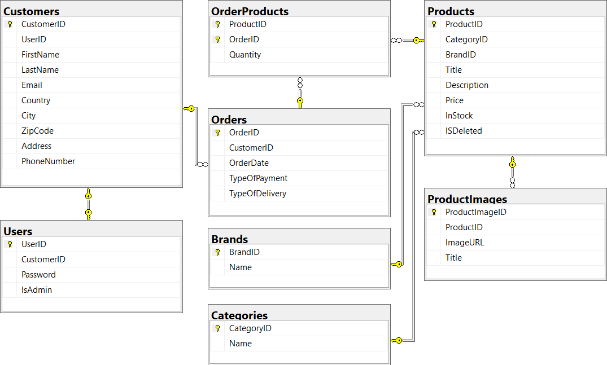

# EF Core Webshop

## About The Project
The project and its specifications are defined by the assignment in relation to our lectures on `EF Core` and `Linq`, for which the project is to be handed in as a group project. Our group is formed by **Jasmin 'Jeongoks' Nielsen** and **Mike '_Oiski_' Mortensen**

## Dependencies
- [Microsoft.EntityFramworkCore.SqlServer](https://www.nuget.org/packages/Microsoft.EntityFrameworkCore.SqlServer/)
- [Microsoft.EntityFrameworkCore.Design](https://www.nuget.org/packages/Microsoft.EntityFrameworkCore.Design/5.0.10)
- [Microsoft.EntityFrameworkCore.Tools](https://www.nuget.org/packages/Microsoft.EntityFrameworkCore.Tools/5.0.10)

### Terms of Development

- **Specifications**
  - **Frontpage**
    - Front page shows an amount of product with a picture, the price, the name and a button to place the product in the cart.
    - Paging is used, so that the front page only shows a certain amount of products on each page. Showcase there's more than one product.
    - Search feature where the user has the option to search on "Brand" or "Type" of the product.
    - Search feature with free-text searching.
    - Option to make the filtering of the products shown ASC or DESC.
    - An icon of a cart is shown, as well of the quantity of the products laying in it. If the icon is clicked, it will show the shop cart.
    - If a product is added to the cart, it will be shown on the icon, as well as the updated shop cart.
  - **Shop Cart**
    - The shop cart shows an updated list of chosen products, with picture, name, price per product, quantity (can changes).
    - There needs to be an Update button, which will update the prices if the user changes the quantity already in the cart.
    - It needs to be possible to remove a product from the cart, if the user regrets that choice.
    - There needs to be a Checkout button, which leads to the Checkout-page.
    - There needs to be a button, which gives the user the opportunity to continue shopping, before going to the checkout.
  - **Checkout**
    - The user has to give information about their Email, Name, Address, choice of Payment Method and Delivery type.
    - When the user clicks on the 'Buy' button, they have to receive a mail as a confirmation on their order.
  - **Additional Chosen Specifications**
    - When the mouse hovers over a picture of a product, add some shadow behind it, to highlight it.
    - Opportunity to log in, perhaps when the user is on the Checkout page.
    - If the user is already logged in, then they won't have to write their information again.
    - Make an admin page, giving an administrator a list of all products and the opportunity to update and modify them.

## The program
The assignments states that the following criteria:

**Goal**
> Demonstrate that one can design, program and test a database model that meets the specifications written under _Terms of Development_. The core is to be able to browse through > a collection of shop items, add shop items to a cart, sign up and simulate a purchase.

**Input**
> Input will be provided through a web interface, which is implemented in the second part of the assignment.

**Output**
> Data will be stored in a local SQL Database, which will be controlled and accessed through an EF Core datalayer project.

See the [Wiki](https://github.com/ZhakalenDk/Oiski.School.Wepshop_H3_2021/wiki) for more in depth information about the project.

## Scripts

<details>
  <summary>SQL Installationsscript.</summary>
  
  ```SQL
  CREATE DATABASE WebShopDB
GO
USE WebShopDB
GO
BEGIN TRANSACTION;
GO

CREATE TABLE [CustomerLogins] (
    [CustomerLoginID] int NOT NULL IDENTITY,
    [CustomerID] int NOT NULL,
    [Password] nvarchar(max) NULL,
    CONSTRAINT [PK_CustomerLogins] PRIMARY KEY ([CustomerLoginID])
);
GO

CREATE TABLE [Products] (
    [ProductID] int NOT NULL IDENTITY,
    [Title] nvarchar(max) NULL,
    [Description] nvarchar(max) NULL,
    [BrandName] nvarchar(max) NULL,
    [Price] decimal(18,2) NOT NULL,
    [InStock] int NOT NULL,
    CONSTRAINT [PK_Products] PRIMARY KEY ([ProductID])
);
GO

CREATE TABLE [Types] (
    [TypeID] int NOT NULL IDENTITY,
    [Name] nvarchar(max) NULL,
    CONSTRAINT [PK_Types] PRIMARY KEY ([TypeID])
);
GO

CREATE TABLE [Customers] (
    [CustomerID] int NOT NULL IDENTITY,
    [CustomerLoginID] int NULL,
    [FirstName] nvarchar(max) NULL,
    [LastName] nvarchar(max) NULL,
    [Email] nvarchar(max) NULL,
    [Country] nvarchar(max) NULL,
    [City] nvarchar(max) NULL,
    [ZipCode] int NOT NULL,
    [Address] nvarchar(max) NULL,
    [PhoneNumber] nvarchar(max) NULL,
    [PaymentMethod] int NOT NULL,
    [DeliveryType] int NOT NULL,
    CONSTRAINT [PK_Customers] PRIMARY KEY ([CustomerID]),
    CONSTRAINT [FK_Customers_CustomerLogins_CustomerLoginID] FOREIGN KEY ([CustomerLoginID]) REFERENCES [CustomerLogins] ([CustomerLoginID]) ON DELETE NO ACTION
);
GO

CREATE TABLE [ProductImages] (
    [ProductImageID] int NOT NULL IDENTITY,
    [ProductID] int NOT NULL,
    [ImageStream] varbinary(max) NULL,
    [Title] nvarchar(max) NULL,
    CONSTRAINT [PK_ProductImages] PRIMARY KEY ([ProductImageID]),
    CONSTRAINT [FK_ProductImages_Products_ProductID] FOREIGN KEY ([ProductID]) REFERENCES [Products] ([ProductID]) ON DELETE CASCADE
);
GO

CREATE TABLE [ProductTypes] (
    [ProductID] int NOT NULL,
    [TypeID] int NOT NULL,
    CONSTRAINT [PK_ProductTypes] PRIMARY KEY ([ProductID], [TypeID]),
    CONSTRAINT [FK_ProductTypes_Products_ProductID] FOREIGN KEY ([ProductID]) REFERENCES [Products] ([ProductID]) ON DELETE CASCADE,
    CONSTRAINT [FK_ProductTypes_Types_TypeID] FOREIGN KEY ([TypeID]) REFERENCES [Types] ([TypeID]) ON DELETE CASCADE
);
GO

CREATE TABLE [Orders] (
    [OrderID] int NOT NULL IDENTITY,
    [CustomerID] int NOT NULL,
    [OrderDate] datetime2 NOT NULL,
    CONSTRAINT [PK_Orders] PRIMARY KEY ([OrderID]),
    CONSTRAINT [FK_Orders_Customers_CustomerID] FOREIGN KEY ([CustomerID]) REFERENCES [Customers] ([CustomerID]) ON DELETE CASCADE
);
GO

CREATE TABLE [OrderProducts] (
    [ProductID] int NOT NULL,
    [OrderID] int NOT NULL,
    CONSTRAINT [PK_OrderProducts] PRIMARY KEY ([ProductID], [OrderID]),
    CONSTRAINT [FK_OrderProducts_Orders_OrderID] FOREIGN KEY ([OrderID]) REFERENCES [Orders] ([OrderID]) ON DELETE CASCADE,
    CONSTRAINT [FK_OrderProducts_Products_ProductID] FOREIGN KEY ([ProductID]) REFERENCES [Products] ([ProductID]) ON DELETE CASCADE
);
GO

CREATE UNIQUE INDEX [IX_Customers_CustomerLoginID] ON [Customers] ([CustomerLoginID]) WHERE [CustomerLoginID] IS NOT NULL;
GO

CREATE INDEX [IX_OrderProducts_OrderID] ON [OrderProducts] ([OrderID]);
GO

CREATE INDEX [IX_Orders_CustomerID] ON [Orders] ([CustomerID]);
GO

CREATE INDEX [IX_ProductImages_ProductID] ON [ProductImages] ([ProductID]);
GO

CREATE INDEX [IX_ProductTypes_TypeID] ON [ProductTypes] ([TypeID]);
GO

COMMIT;
GO

  ```
  
 </details>

## Diagrams

### Class Diagram over Entities


### Entity Relation Diagram over DB


### DB Drawing of the Project Build


## Versioning
Versioning is coordinated according to the following template: [_Major_].[_Minor_].[Patch].\
Each `Feature` must be branched out and developed on an isolated branch and merged back into the `Developer` branch when done.

The syntax for the structure of branch folders must be presented as: [MajorVersion]/[DeveloperName]/[BranchName], where as [BranchName] should be formatted as follows: [Feature]_[SubFeature].\
**Example:**
>**Folder Structure:** _v1/Oiski_ \
>**Branch Name:** _Interface_MainMenu_ \
>**Full Path:** _v1/Oiski/MainMenu_UIOverhaul_

### Change Log
- **[v0.0.0](https://github.com/Mike-Mortensen-Portfolio/Oiski.School.Webshop_H3_2021/releases/tag/v0.0.0)**
    - Added
      - Project Solution
      - Console Application Project - _For testing features_
      - Datalayer Class Library project - _The backend stuff (EF Core)_
- **[v0.1.0](https://github.com/Mike-Mortensen-Portfolio/Oiski.School.Webshop_H3_2021/releases/tag/v0.1.0)**
    - **Added**
      - `WebShopContext` with ConnectionString.
    - **Prepared**
      - Properties of `DbSet<>` of Entities.
      - DataSeeding for Initialize of Database.
- **[v0.2.0](https://github.com/Mike-Mortensen-Portfolio/Oiski.School.Webshop_H3_2021/releases/tag/v0.2.0)**
    - **Added**
      - `Customer` class
      - `CustomerLogin` class - _The login Info for a customer_
      - `Order` class
      - `Product` class
      - `ProductImage` class
      - `Type` class - _A product type container (Many to Many)_
    - Modified
      - README file to include a section for diagrams and added class diagram over entities
- **[v0.2.1](https://github.com/Mike-Mortensen-Portfolio/Oiski.School.Webshop_H3_2021/releases/tag/v0.2.1)**
    - **Fixed**
      - Password is now a string as intended
- **[v0.3.0](https://github.com/Mike-Mortensen-Portfolio/Oiski.School.Webshop_H3_2021/releases/tag/v0.3.0)**
    - **Fixed**
      - `ImageID` changed to `ProductImageID`, to create Primary Key.
      - Added a Reference Navigational Property to `Customer` inside of `Order`. 
- **[v0.3.1](https://github.com/Mike-Mortensen-Portfolio/Oiski.School.Webshop_H3_2021/releases/tag/v0.3.1)**
    - **Added**
      - Inside of `WebShopContext` and in the `OnModelCreating()` there's added a `region` called DATA SEEDING, all of the data is in a comment, due to some `Entities` missing.
- **[v0.4.0](https://github.com/Mike-Mortensen-Portfolio/Oiski.School.Webshop_H3_2021/releases/tag/v0.4.0)**
    - **Added**
      - `ProductType` class
      - `OrderProduct` class
      - Combined key for `OrderProduct` and `ProductType` in `WebshopContext`
      - Defined `CustomerLogin` property as Foreign Key in `Customer`
      - Added an Orders Collection Navigational Property in `Customer`
      - Specified custom table names for all classes
    - **Removed**
      - Orders Navigational Property in `CustomerLogin`
      - Added `OrderProduct` Navigational Property in `Order`
      - Added `OrderProduct` Navigational Property in `Product`
      - Added Navigational Property for `ProductType` in `Product`
      - Added `ProductID` Property in `ProductImage`
      - Added `ProductType` Navigational Property in `Type`
      - Added DB ER-Diagram
    - **Changed**
      - Rearranged Class Diagram
      - Added DB ER-Diagram to README
      - Rebuilded Initial Migration configuration

## [Oiski.School Namespace Collection](https://github.com/Mike-Mortensen-Portfolio) <-- Click Me
